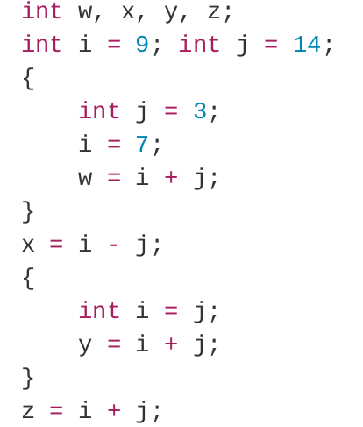
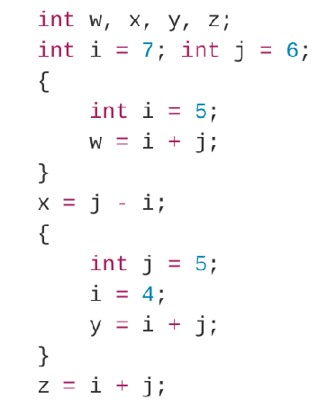
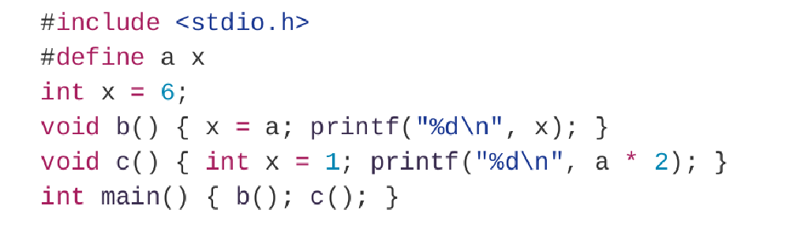

# HW1

> 知识点：
>
> - 编译器vs解释器
> - 汇编vs机器语言
> - 变量作用域（代码块内外）

## 练习1.1.1

**编译器相对于解释器的优点是什么？解释器相对于编译其的优点是什么？**

编译器将源代码一次性转换成目标代码，生成可执行文件，而解释器将源代码逐行翻译成机器代码并立即执行，不会生成可执行文件。

编译器相对于解释器的优点：

1. 执行速度快；
2. 代码保护：目标代码不易反向翻译回源代码，编译后的程序相对难以逆向工程；
3. 运行过程独立：编译后的程序可以在没有安装编译器的情况下运行。

解释器相对于编译器的优点：

1. 快速开发和测试：修改代码后可以编译并执行单行，无需编译整个文件。
2. 跨平台：解释器通常会提供对多种平台的支持，使得程序可以在不同系统上运行。
3. 灵活性：解释器可以在运行时动态处理程序，比如动态类型语言可以在运行时改变变量的类型。

## 练习1.1.2

**在一个语言处理系统中，编译器产生汇编语言而不是机器语言的好处是什么？**

1. **可移植性**：汇编语言是相对于特定架构的低级语言，相对于机器语言来说，仍然是相对抽象的，可以通过编写汇编语言代码来实现对不同平台的支持，而不必为每个特定的硬件平台单独编写完全不同的机器代码版本。

2. **易于调试**：汇编语言相对于机器语言来说，更容易阅读和理解。这使得在调试过程中能够更容易地debug。

3. **跨平台开发**：汇编语言可以用于多个平台，因为它是相对抽象的，不依赖于特定硬件架构。这使得开发人员能够将代码从一个平台移植到另一个平台，只需对相应的汇编代码进行适当的调整。

4. **性能优化**：汇编语言是可读的，程序员可以利用汇编语言的特性来人工进行一些高级的性能优化。

## 练习1.1.3

对下图中的块结构的C代码，指出赋给w、x、y和z的值

1.  
2. 


1. ```
   w = 10
   x = -7
   y = 28
   z = 21
   ```

2. ```
   w = 11
   x = -1
   y = 9
   z = 10
   ```

 

## 练习1.1.4

下面的C代码的打印结果是什么？



```
6
2
```


## 练习1.1.5*

有人把程序设计语言分为编译型和解释型两类，例如C是编译型，Python是解释型。这个分类是否合理？能否构建C语言的解释器，或者Python的静态编译器？谈谈你的看法。

编译型语言是指在程序执行前，通过编译器将源代码转化为目标机器能够直接执行的机器代码或者中间代码；解释型语言是指在程序执行时，通过解释器逐行解释源代码，并将其转化为目标机器的执行指令。**常规情况下**C语言是按前一个方法编译运行，而Python按后者，故该说法有一定合理性。

但这种分类并不绝对，我们也可以构建一个C语言的解释器，使它能够在运行时解释执行C代码。同样地，也可以对Python进行静态编译，将其转化为机器代码。可以认为这种分类更倾向描述一门语言的**典型使用方式**。