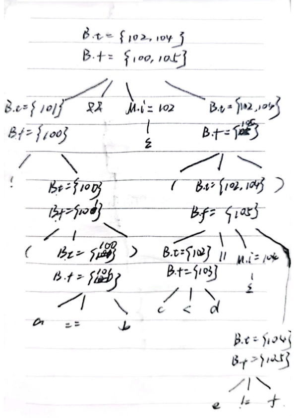

# HW 11

2020K8009915008 林孟颖

## 练习6.2.1：

假定图 6-26 中的函数 widen 可以处理图 6-25a 的层次结构中的所有类型，翻译下列表达式。假定 c 和 d 是 char 型，s 和 t 是 short 型，i 和 j 是 int 型，x 是 float 型。
x = s + c
i = s + c
x = ( s + c ) * ( t + d )

---

1. 

```
t1 = (int)s
t2 = (int)d
j = t1 + t2
```

2.

```
t1 = (int)s
t2 = (int)d
t3 = t1 + t2
x = (float)t3
```


3. 

```
t1 = (int)s
t2 = (int)d
t3 = t1 + t2
t4 = (int)t
t5 = (int)c
t6 = t4 + t5
t7 = t3 * t6
x = (float)t7
```


## 练习6.2.2：

在图 6-36 的语法制导定义中添加处理下列控制流构造的规则：
S→ repeat S1 until B，当 B 为真时结束循环
S→ for ( S1 ; B ; S2 ) S3

---

1.

```
S1.next = newlabel()
B.true = S.next
B.false = newlabel()
S.code = label(B.false) || S1.code || label(S1.next) || B.code
```

2.

```
S1.next = newlabel()
B.true = newlabel()
B.false = S.next
S2.next = S1.next
S3.next = newlabel()
S.code = S1.code || label(S1.next) || B.code || label(B.true) ||
S3.code || label(S3.next) || S2.code || gen('goto' S1.next)
```


## 练习6.2.3：

使用图 6-43 中的翻译方案翻译下列表达式
	!(a == b) && (c < d || e != f)
给出分析过程给出带 truelist 和 falselist 的注释语法分析树。假设第一条被生成的指令的地址是100。




对于a==b：

```
100: if a==b goto -
101: goto -
```

有

```
B.t = {100}
B.f = {101}
```

对于（a==b）：

```
B.t = {101}
B.f = {100}
```

$B-> B_1\&\&MB_2$中，M记录B2入口：

```
M.i = {102}
```

对于c<d：

```
102: if c<d goto -
103: goto -
```

有

```
B.t = {102}
B.f = {103}
```

$B-> B_1\&\&MB_2$中，M记录B2入口：

```
M.i = {104}
```

对e!=f：

```
104: if e!=f goto -
105: goto -
```

有：

```
B.t = {104}
B.f = {105}
```

对 $c<d||e!=f$，执行`backpatch({103},104)`后:

```
102: if c<d goto -
103: goto 104
104: if e!=f goto -
105: goto -
```

有

```
B.t = {102,104}
B.f = {105}
```

对于$!(a==b)\&\& (c<d||e!=f)$，执执行`backpatch({101},102)`后:

```
100: if a==b goto -
101: goto 102
102: if c<d goto -
103: goto 104
104: if e!=f goto -
105: goto -
```

有

```
B.t = {102,104}
B.f = {100,105}
```


## 练习6.2.4*： （选做）

假设下面的 C 语言表达式合法且不存在隐式类型转换，推导各个符号可能类型的最一般情况并解释你的方法
	(p(L) ? init : f(init, L[0])) + 3
提示：C 语言中数组的下标运算实际上存在从数组到指针的隐式转换，参考https://zh.cppreference.com/w/c/language/operator_member_access