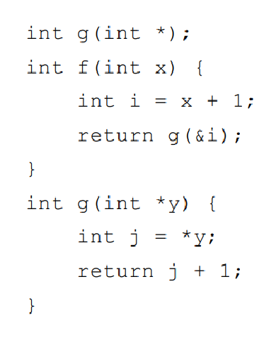

# HW12

2020K8009915008 林孟颖

## 练习7.1.1：

考虑 C 语言的函数 f 和 g：按照图7-7的约定，不考虑编译器优化，讨论当 f 调用 g 而 g 即将返回时运行时栈的状态，其中 f 的参数x = 3 。只需要讨论返回值、参数、控制链和代码中体现的局部数据。指出

1. 哪个函数在栈中为各个元素创建了所使用的空间？
2. 哪个函数写入了各个元素的值？参数、返回值和局部变量的值是什么？
3. 这些元素属于哪个活动记录？

1. **空间创建：**
   - 函数 `f` 在栈上为参数 `x` 和局部变量 `i` 创建了空间。
   - 函数 `g` 在栈上为指针参数 `y` 和局部变量 `j` 创建了空间。
2. **值的写入：**
   - 函数 `f` 写入了 `x` 和 `i` 的值。`x` 是函数 `f` 被调用时传入的参数，值为 3。`i` 是 `x + 1`，即 4。
   - 函数 `g` 写入了 `*y`（即 `i`）和 `j` 的值。`*y` 是从 `f` 传递的 `i` 的值，即 4。`j` 是 `*y + 1`，即 5。
   - 返回值是由 `g` 写入的，`j + 1`，即 6。
3. **活动记录归属：**
   - 参数 `x`、局部变量 `i` 以及 `f` 函数调用 `g` 的返回地址属于 `f` 的活动记录。
   - 参数 `y`、局部变量 `j` 以及 `g` 返回到 `f` 的地址属于 `g` 的活动记录。

## 练习7.1.2

考虑下面的Fibonacci函数：
嵌套在fib0中的是fib1，它假设n >= 2并计算第n个Fibonacci数。嵌套在fib1中的是fib2，它假设n >= 4。请注意，fib1和fib2都不需要检查基本情况。我们考虑从对main的调用开始，直到（对fib0(1)的）第一次调用即将返回的时段。

1. 请描述出当时的活动记录栈，并给出栈中的各个活动记录的访问链。
2. 假设我们使用display表来实现下图中的函数。请给出 fib0(1) 的第一次调用即将返回时的display表。同时指明那时在栈中的各个活动记录中保存的display表条目。

1. 假设栈自顶向下生长：

| Real Parameters: None              |
| ----------------------------------- |
| Main                               |
| Access Link: Main                  |
| Real Parameters:  Integer n=4 |
| fib0                               |
| Access Link: fib0(4)  --> main() |
| Real Parameters:  Integer n=4 |
| fib1                               |
| Access Link: fib1(4) --> fib0(4)  |
| Real Parameters:  Integer n=4 |
| fib2                               |
| Access Link: fib2(4) --> fib1(4) |
| Real Parameters:  Integer n=3 |
| fib1                               |
| Access Link:  fib1(3) --> fib0(4) |
| Real Parameters:  Integer n=2 |
| fib0                               |
| Access Link:  fib0(2) --> main() |
| Real Parameters:  Integer n=2 |
| fib1                               |
| Access Link:  fib1(2) --> fib0(2) |
| Real Parameters:  Integer n=1 |
| fib0                               |
| Access Link:  fib0(1) --> main() |

2.  |d[1]-->1| 1. Main     |
   |----| ---------------------------------- |
   | d[2]-->15 | 2. fib0(4)  |
   | d[3]-->13 | 3. d[2]     |
   | d[4]-->7  | 4. fib1(4)  |
   |           | 5. d[3]     |
   |           | 6. fib2(4)  |
   |           | 7. d[4]     |
   |           | 8. fib1(3)  |
   |           | 9. d[3]     |
   |           | 10. fib0(2) |
   |           | 11. d[2]    |
   |           | 12. fib1(2) |
   |           | 13. d[3]    |
   |           | 14. fib0(1) |
   |           | 15. d[2]    |

其中`--> i` 意味着指向右侧i号格子