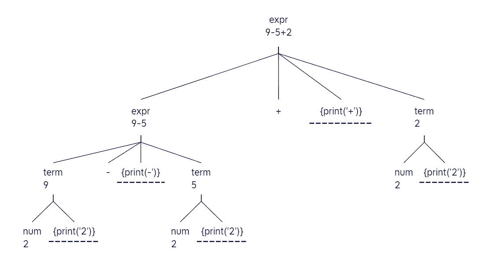
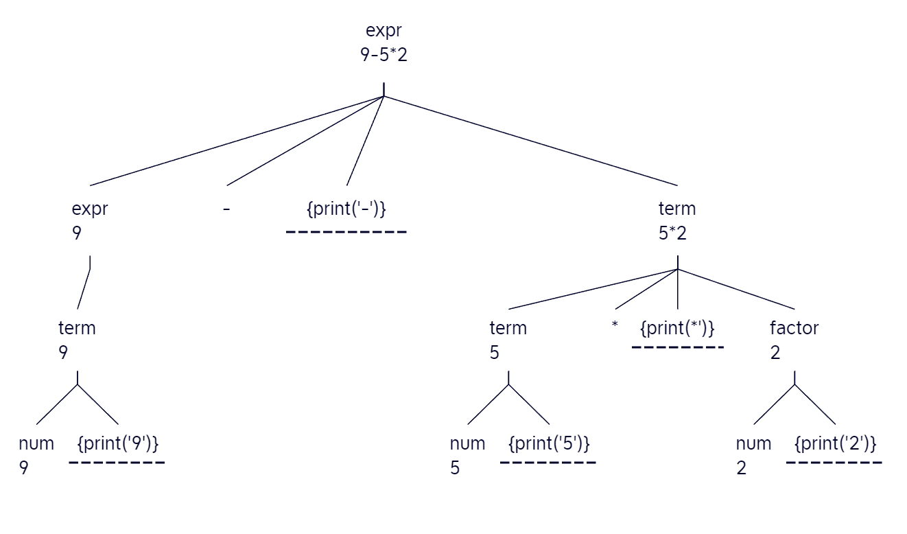

# HW2

> 知识点：
>
> - 串的派生；
> - 语法分析树；
> - 文法语言；
> - 文法二义性（递归or反证）；
> - 语法制导翻译方案

## 练习2.1.1：

考虑下面的上下文无关文法：
	S→ +SS | *SS | a 

1) 试说明如何使用文法生成串*a+aa
2) 试为这个串构造一颗语法分析树
3) 该文法生成的语言是什么？
4) 该文法具有二义性吗？为什么？

1. 
   ```
   S → *SS
     → *aS
     → *a+SS
     → *a+aS
     → *a+aa
   
   ```
   
1. ```
          S
        / |  \
       *  S   S
          |  / | \
          a  + S  S
               |  |
               a  a
   ```
   
1. ```
   L(G) = +Sa|+aS|*Sa|*aS|a
   ```
   即该文法生成的语言是以{a,+,*}为前缀的奇数长表达式。
   
4. 该文法不具有二义性，可由递归证明：

      1）当生成串长度为1时，该串为a，生成式为

      ```
      S->a
      ```

      生成方式唯一；

      2）假设当生成串长度为2k+1时（k>1），串的生成方式都唯一，对于长度为2k+3的串，其可视作由长度2k+1的串经历如下变换得来：

      ```
      ()a()-->()S()
      ->()+aa()|()*aa()
      ```

      其中`()`代表通配符，`-->`代表派生的逆过程，可见无论生成`()+aa()`还是`()+aa()`，其派生过程都是唯一的，故长度为2k+3的串生成方式也都唯一。

      3）综上，文法不具有二义性。
      
      > 附反证法：
      >
      > 1. 假设最短具有二义性的串为s，显然s非a，则s必含+或者\*且以之开头，不妨假设s首个符号为\*。
      >    则有s=\*s1s2， S1->s1且S2->s2，
      > 2. 由于s1，s2比s短，其派生过程没有二义；由s有二义可知存在划分
      >    s=\*s1‘s2’且s1'!=s1,
      > 3. 不妨假设s1‘比s1短，即s1'是s1的一个真前缀，
      > 4. 由归纳法可得如下两个引理：对于任意串s，若其前是*或者+（即\*s或者+s，如我们上述的\*s1）
      >    - 其任意真前缀都有*和+的个数不少于a的个数；
      >    - s中*和+的个数比a的个数少1
      > 5. 则由引理1应有s1'的\*和+的个数不少于a的个数；
      >    由引理2应有s中*和+的个数比a的个数少1，矛盾，可知假设错误。

## 练习2.1.2：考虑文法

num → 101∣1111∣num 0∣num num
1) 证明：用该文法生成的所有二进制串的值都能被5整除（提示：对语法分析树的结点数目，即推导步数，使用数学归纳法）
2) 上面的文法是否能够生成所有能被5整除的二进制串？


1. **基础步骤**：

   - 对于产生式 `num → 101`，生成的二进制串是 `101`，其十进制值为5，可以被5整除。
   - 对于产生式 `num → 1111`，生成的二进制串是 `1111`，其十进制值为15，也可以被5整除。

   **归纳步骤**： 假设所有语法分析树高为k的二进制串的值（记为`num_{k}`）都能被5整除，观察高为k+1的二进制串：

   - 对于产生式 `num_{k+1} → num_{k} 0`，由于原始的`num_{k}`可以被5整除，所以在其后面添加一个0（即乘以2）后得到的新的二进制串的值也可以被5整除。
   - 对于产生式 `num_{k+1} → num_{k} num_{k}`，由于两个`num_{k}`都可以被5整除，所以它们的组合也可以被5整除。

   综上，用该文法生成的所有二进制串的值都能被5整除。

2. 不能，已知0能被5整除，而该文法只能产生带有1的二进制串，故不能。

## 练习2.1.3

构建一个语法制导翻译方案，该方案把算术表达式从中缀表示方式翻译为运算符在运算分量之后的后缀表示方式。例如，xy−是表达式x−y的后缀表示。给出输入9−5+2和9−5∗2的注释分析树。

1. 让`E`表示表达式，`T`表示项，`F`表示因子，产生式如下：

```
E → E + T  | E - T  | T
T → T * F  | T / F | F
F → ( E ) | num 
```

对应翻译方案：

```
(1) E → E + T { print('+') }
(2) E → E - T { print('-') }
(3) E → T
(4) T → T * F { print('*') }
(5) T → T / F { print('/') }
(6) T → F
(7) F → ( E )
(8) F → num { print(num) }
```

2. 
   1）对于9-5+2：

   

   2）对于9-5*2：

   


> 订正：本题是后缀表达式，故应有`E.expr=95-2+`等

## 练习2.1.4

C语言和Java语言中的for语句具有如下形式：
for ( expr1 ; expr2 ; expr3 ) stmt
第一个表达式在循环之前执行，它通常被用来初始化循环下标。第二个表达式是一个测试，它在循环的每次迭代之前执行。如果这个表达式的结果变成0，就退出循环。循环本身可以被看作语句{ stmt expr3 ;}。第三个表达式在每一次迭代的末尾执行，它通常用来使循环下标递增，故for语句的含义类似于
expr1 ; while(expr2) { stmt expr3 ;}
仿照图2-43中的类If，为for语句定义一个类For。

```java
public class For extends Stmt {
    Expr expr1, expr2, expr3; // for语句中的三个表达式
    Stmt stmt;                // 循环体

    public For(Expr e1, Expr e2, Expr e3, Stmt s) {
        expr1 = e1;
        expr2 = e2;
        expr3 = e3;
        stmt = s;
    }

    public void gen(int b, int a) {
        int label1 = newlabel();  // label1用于expr1的代码
        int label2 = newlabel();  // label2用于expr2的测试
        int label3 = newlabel();  // label3用于stmt和expr3的代码

        emitlabel(label1);
        expr1.gen();
        emitlabel(label2);
        emit("if " + expr2.reduce().toString() + " == false goto " + a);
        stmt.gen(b, label3);
        emitlabel(label3);
        expr3.gen();
        emit("goto " + label2);
    }
}

```

## 练习2.1.5*

给出一个文法，生成所有被3整除的正整数的二进制串并给出证明。

> ps：给出的文法有误，无法生成1001

**文法**：$G: S -> 0|11|SS$

**Proof**: 

为了证明文法 S→0∣11∣SSS→0∣11∣SS 可以生成所有3的倍数，我们需要证明两个方向：

1. 任何由此文法生成的二进制串都表示3的倍数。
2. 所有3的倍数都可以由此文法生成。

**1. 任何由此文法生成的二进制串都表示3的倍数：**

- 对于基础产生式：
  - `0` 在十进制中表示0，是3的倍数。
  - `11` 在十进制中表示3，也是3的倍数。
- 对于归纳产生式 `SS`： 如果两个二进制串 $S1$ 和 $S2$ 都表示3的倍数，即 $S1=3k_1$ 且$S2=3k_2$，则它们的串联 $S1S2=3(k_1+k_2)$  也表示3的倍数。

**2. 所有3的倍数都可以由此文法生成：**

考虑一个3的倍数的二进制表示：

- 如果它的长度是偶数，那么我们可以将其分为两个长度相等的部分，每部分都是3的倍数。这是因为当我们从二进制转换为十进制时，将左半部分设为$left$，右半部分为$right$，则$num=left*2^{k}+right$，由于$2^k$是偶数，若整个数是3的倍数，则$left$和$right$都需是3的倍数。

- 如果3的倍数的二进制表示的长度是奇数，在其前面添加一个0，使其长度变为偶数，然后按照上述方法进行。

通过这种方式，我们可以递归地将任何3的倍数分解为更小的3的倍数，直到我们到达基本情况 `0` 或 `11`。
