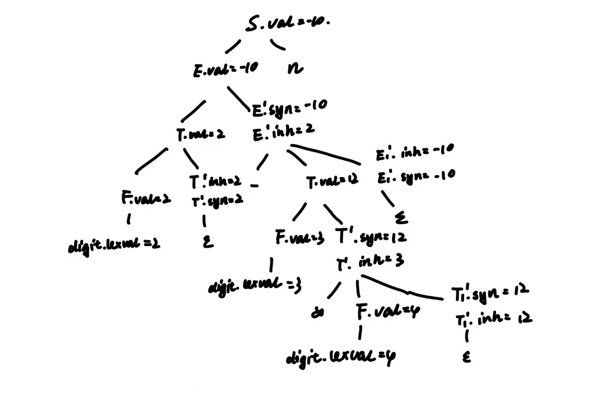

# HW8

> 知识点：
>
> - 消除左递归
>   $$
>   E \rightarrow Ea \\ \Rightarrow \\
>   E \rightarrow E'a, E' \rightarrow aE'| \epsilon
>   $$
>
> - 语法制导定义
>
> - 注释语法分析树（区别于语法分析树）
>
>   > 继承属性自顶向下求，综合自底向上
>
> - 综合/继承属性
>
>   > 通常用`inh`表继承属性（inherent），`syn`表综合属性（synthesized）
>
> - S/L属性
>
>   - S属性：仅使用综合属性；
>   - L属性：产生式关联的的每个属性间，依赖图的边总是从左到右；
>
> - 存在和规则一致的求值过程条件（详见作业末尾）

## 练习5.1.1

考虑文法
	S → E n
	E → E - T | T
	T → T * F | F
	F →  ( E ) | digit
其中 S, E, T, F 为非终结符

1. 消除左递归
2. 对消除左递归后的文法，给出一个语法制导定义，使得 S.val 为表达式 S 的值。注：digit.lexval 表示数字字面量的值；
3. 使用上面得到的 SDD，给出 2 - 3 * 4 n 的注释语法分析树


1. ```
   S → E n
   E → T E'
   E' → - T E' | ε
   T → F T'
   T' → * F T' | ε
   F → ( E ) | digit
   ```

2. | 产生式            | 语义规则                                            |
   | ----------------- | --------------------------------------------------- |
   | $ S → E n 	$   | $ S.val = E.val $                                   |
   | $ E → T E' $      | $ E.val = E'.syn$ <br />$E '.inh = T.val$           |
   | $ E' → - T E_1' $ | $ E_1'.inh = E'.inh-T.val$ <br />$ E'.syn=E_1'.syn$ |
   | $ E' → ε$         | $E'.syn=E'.inh $                                    |
   | $ T → F T'$       | $ T'.inh = F.val$ <br />$ T.val=T'.syn$             |
   | $ T' → * F T_1'$  | $ T_1'.inh = T'.inh*F.val$<br />$T'.syn=T_1'.syn$   |
   | $ T' → ε$         | $ T'.syn=T'.inh$                                    |
   | $ F → ( E )$      | $ F.val=E.val$                                      |
   | $ F → digit$      | $ F.val=digit.lexval$                               |

3. 

   


## 练习5.1.2

考虑产生式 A→BCD，其中 A、B、C、D 四个非终结符各有综合属性 s 和继承属性 i 。对于下面的规则

a. B.i = A.i; A.s = B.i + C.s

b. B.i = A.i; A.s = B.i + C.s; D.i = A.i + B.s

c. A.s = B.s + C.s

分别讨论

1. 这些规则是否满足 S 属性的要求？
2. 这些规则是否满足 L 属性的要求？
3. 是否存在和这些规则一致的求值过程？若不存在，请说明理由

S属性：仅使用综合属性；

L属性：产生式关联的的每个属性间，依赖图的边总是从左到右；

| 规则 | S属性 | L属性 | 是否存在一致求值过程 |
| ---- | ----- | ----- | -------------------- |
| a    | x     | √     | √                    |
| b    | x     | √     | √                    |
| c    | √     | √     | √                    |

## 存在一致求值过程？

### 条件

- 属性依赖条件：每个属性的计算只依赖于
  - 当前节点的子节点的属性（对于综合属性）
  - 其父节点和兄弟节点的属性（对于继承属性）
- 计算顺序：确认是否可以为语法分析树中的每个节点确定一个属性计算的顺序，使得在计算任何属性之前，它所依赖的所有属性都已经被计算

### 一些反例

#### 1. 循环依赖

假设有以下属性文法规则：

```
A → B C
B.i = A.s
C.i = B.s
A.s = C.s
```

这里，继承属性 `B.i` 依赖于 `A.s`，而 `A.s` 又依赖于 `C.s`，而 `C.s` 又依赖于 `B.s`。这形成了一个循环依赖，无法确定一个一致的计算顺序。

#### 2. 依赖于未定义属性

考虑以下规则：

```
A → B C
A.s = B.s + C.s
```

如果 `B.s` 和 `C.s` 在其对应的产生式中没有被定义或计算，那么 `A.s` 的值就无法确定。这种情况下，由于依赖的属性未定义，无法进行一致的求值。

#### 3. 基于右侧兄弟节点的继承属性

假设有以下规则：

```
A → B C
B.i = C.s
C → D
```

这里，`B` 的继承属性 `i` 依赖于其兄弟节点 `C` 的综合属性 `s`。如果 `C.s` 在计算 `B.i` 之前没有被计算，那么就无法为 `B.i` 确定一个值。这违反了属性文法的一个基本原则，即继承属性不应该依赖于右侧兄弟节点的综合属性。
