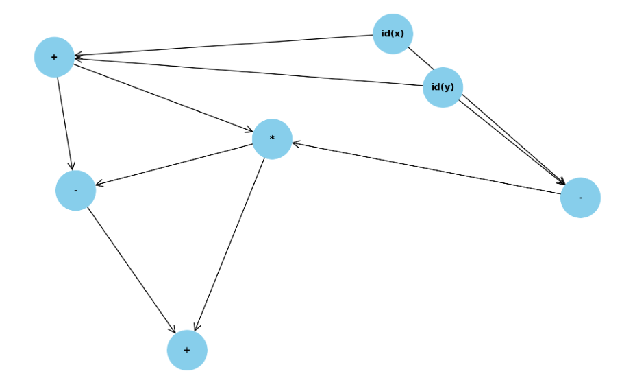
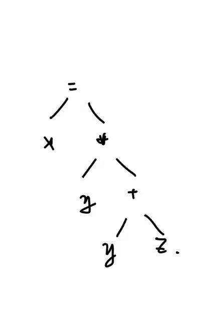
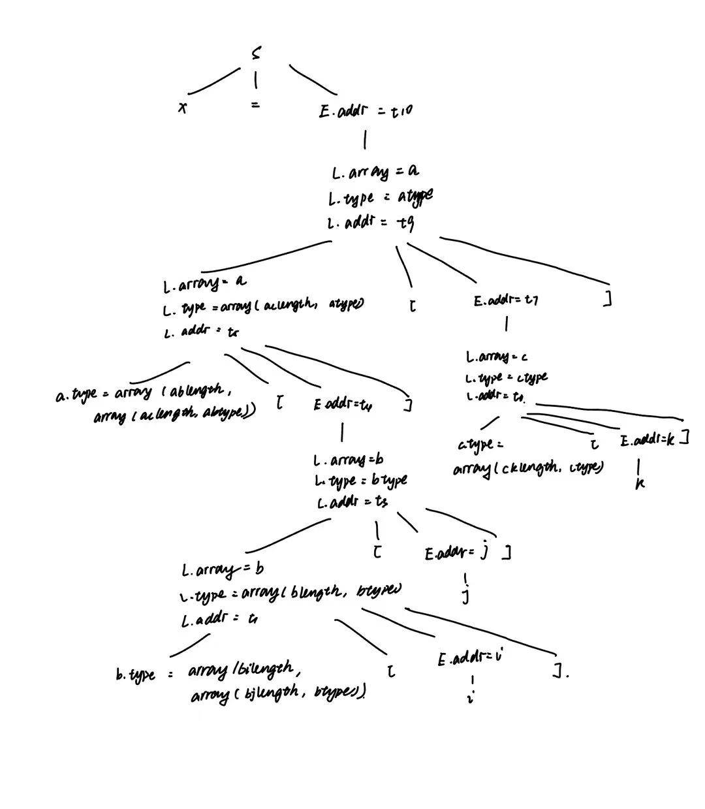

# HW 10

> 知识点：
>
> - DAG构建（其定义是有向无环图，但课本和答案都没画箭头，那就不画了吧😅）
>
> - 抽象语法树
>
> - 四元式序列
>
>   > op  arg1  arg2  result
>
> - 三元式序列
>
>   > op  arg1  arg2
>
> - 间接三元式序列
>
>   > 较三元式额外加了个inst表格，列出指向三元式的指针
>
> - 类型长度和相对偏移
>
>   > Note：偏移是相对其所在数据区字段而言的
>   >
>   > 如：
>   >
>   > ```C
>   > 	// ENV 1
>   > 	record { 
>   > 		// ENV 2
>   > 		float y; 
>   > 		record { 
>   > 			// ENV 3
>   > 			int tag; float x; } m;
>   > 		} p;
>   > ```
>   >
>   > 上述tag的偏移是在ENV3中计算的，故为0；
>   >
>   > m的是在ENV2计算的，偏移为sizeof(float)（y占去的空间）。

### 练习6.1.1

为下列表达式构建 DAG 并指出每个子表达式的值编码
	((x + y) - ((x + y) * (x - y))) + ((x + y) * (x - y))

---

| 序号 | op   | l    | r    |
| ---- | ---- | ---- | ---- |
| 1    | id   | x    |      |
| 2    | id   | y    |      |
| 3    | +    | 1    | 2    |
| 4    | -    | 1    | 2    |
| 5    | *    | 3    | 4    |
| 6    | -    | 3    | 5    |
| 7    | +    | 6    | 5    |



> 用networkx.DiGraph可视化

### 练习6.1.2

将语句 x = y * (y + z) 翻译为

1. 抽象语法树
2. 四元式序列
3. 三元式序列
4. 间接三元式序列

----

1. 


2. | 序号 | op   | arg1 | arg2 | result |
   | ---- | ---- | ---- | ---- | ------ |
   | 0    | +    | y    | z    | t2     |
   | 1    | *    | y    | t2   | t3     |
   | 2    | =    | t3   |      | x      |


3. | 序号 | op   | arg1 | arg2 |
   | ---- | ---- | ---- | ---- |
   | 0    | +    | y    | z    |
   | 1    | *    | y    | (0)  |
   | 2    | =    | x    | (1)  |
   
4. 
   | -    | Inst |
   | ---- | ---- |
   | 0    | (0)  |
   | 1    | (1)  |
   | 2    | (2)  |

   | -    | op   | arg1 | arg2 |
   | ---- | ---- | ---- | ---- |
   | 0    | +    | y    | z    |
   | 1    | *    | y    | (0)  |
   | 2    | =    | x    | (1)  |

   
### 练习6.1.3

确定下列声明序列中各个标识符的类型和相对地址，这里我们使用龙书 6.3.2 中提到的文法。
	float x;
	record { float x; float y; } p;
	record {
		record { int tag; float x; } m;
		float y;
	} q;


---

| line | name | type     | offset | env  |
| ---- | ---- | -------- | ------ | ---- |
| 1    | x    | float    | 0      | 1    |
| 2    | x    | float    | 0      | 2    |
| 2    | y    | float    | 8      | 2    |
| 2    | p    | record() | 8      | 1    |
| 4    | tag  | int      | 0      | 4    |
| 4    | x    | float    | 4      | 4    |
| 4    | m    | record() | 0      | 3    |
| 5    | y    | float    | 12     | 3    |
| 6    | q    | record() | 24     | 1    |


### 练习6.1.4

考虑龙书图 6-22 的翻译方案，翻译赋值语句
	x = a\[b\[i\]\[j\]\]\[c\[k\]\];
       并给出注释语法分析树。

