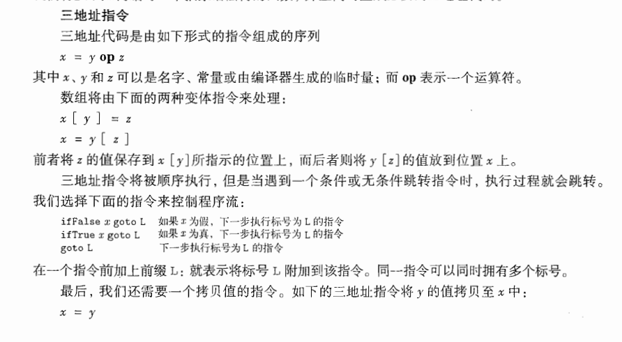
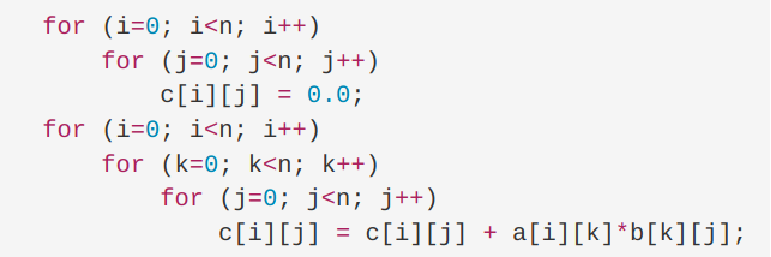
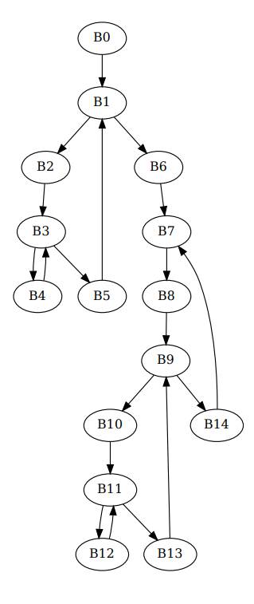
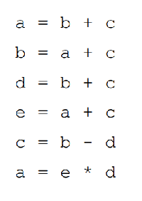
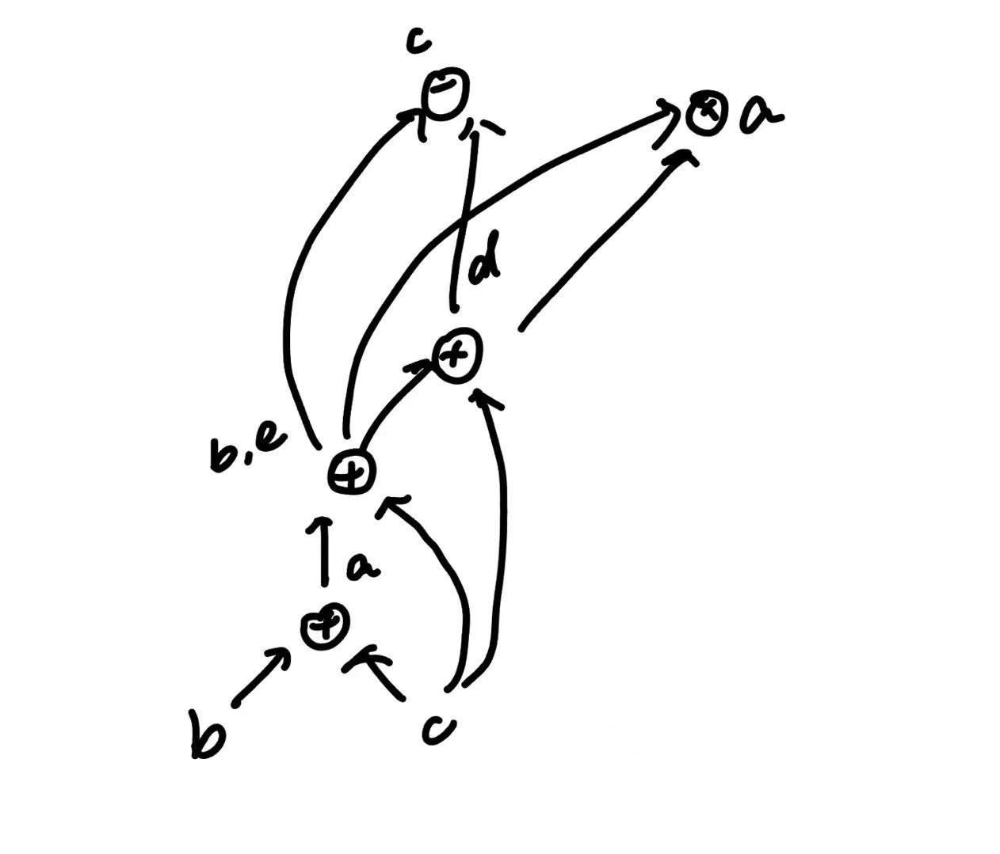

2. HW14
   
   > 知识点：
   >
   > - 三地址指令基本块划分
   >
   >   > 三地址指令使用课本给出的格式：
   >   >
   >   > 
   >   >
   >   > 基本块：总是逐个顺序执行的代码块，无跳转（且一旦执行必须全部执行，否则看上去8.2.1第一题的3和4也能放在一起，但是后续有指令跳转到4，而没有执行3，故将二者划分成两个基本块）
   >
   > - 流图：绘制&找loop
   >
   > - 代码优化
   >
   >   - 寻找局部公共子表达式：结点运算符和子节点都相同
   >
   >   - 消除死代码：没有父节点的结点
   >
   >   - 代数恒等式的使用
   >
   >     - 一些naive步骤：x*1=x，x+0=x
   >     - /强度消减：y^2 -> y * y
   >     - 常量合并：直接计算常量部分
   >
   >   - 进行语句重排：重排的语句间没有依赖关系
   >
   >     
   
   ### 练习8.2.1：
   
   考虑下面的矩阵乘法程序：
   
   1. 假设每个矩阵元素占4字节，且矩阵按行存放，把程序翻译成本节中的三地址语句并标出基本块
   2. 为1. 中得到的代码构造流图
   3. 找到2. 中流图中的循环
   
   
   
   1.
   
   ```
   B0:
   (1) i=0
   B1:
   (2) if i>=n goto (13)
   B2:
   (3) j=0
   B3:
   (4) if j>=n goto (11)
   B4:
   (5) t0=i*n
   (6) t1=t0+j
   (7) t2=t1*4
   (8) c[t2]=0.0
   (9) j=j+1
   (10) goto (4)
   B5:
   (11) i=i+1
   (12) goto(2)
   B6:
   (13) i=0
   B7:
   (14) if i>=n goto (40)
   B8:
   (15) k=0
   B9:
   (16) if k>=n goto (38)
   B10:
   (17) j=0
   B11:
   (18) if j>=n goto (36)
   B12:
   (19) t1 = i * n
   (20) t2 = k * n
   (21) t3 = t1 + j
   (22) t3 = t3 * 4   
   (23) t4 = t2 + j
   (24) t4 = t4 * 4   
   (25) t5 = a[t3]    // Load a[i][k]
   (26) t6 = b[t4]    // Load b[k][j]
   (27) t7 = t5 * t6
   (28) t8 = i * n
   (29) t9 = t8 + j
   (30) t9 = t9 * 4   
   (31) t10 = c[t9]   // Load c[i][j]
   (32) t11 = t10 + t7
   (33) c[t9] = t11   // Store the new value of c[i][j]
   (34) j = j + 1
   (35) goto (18)
   B13:
   (36) k = k + 1
   (37) goto (16)
   B14:
   (38) i = i + 1
   (39) goto (14)
   ```
   
   
   
   2. 有向边包括：
   
      ```python
      [
          ('B0', 'B1'), ('B1', 'B2'), ('B1', 'B6'), ('B2', 'B3'), ('B3', 'B4'),
          ('B3', 'B5'), ('B4', 'B3'), ('B5', 'B1'), ('B6', 'B7'), ('B7', 'B8'),
          ('B9', 'B14'), ('B8', 'B9'), ('B9', 'B10'), ('B10', 'B11'), 
          ('B11', 'B12'), ('B11', 'B13'), ('B12', 'B11'), ('B13', 'B9'), ('B14', 'B7')
      ]
      ```
   
      用graphviz绘图：
      
   
   3. ```
      {B3, B4}
      {B1, B2, B3, B4, B5}
      {B11, B12}
      {B9, B10, B11, B12, B13}
      {B7, B8, B9, B10, B11, B12, B13, B14}
      ```
   
      >
      >
      >Note：本题还需画出EXIT结点
   
   ### 练习8.2.2：
   
   考虑右面的基本块
   
   1. 构造 DAG
   2. 假设只有 a 在基本块出口活跃，尝试优化右面的代码，并简述用到的技术
   
   
   
   1. 
   
   2. ```
      a=b+c
      b=a+c
      d=b+c
      a=b*d
      ```
   
      删除公共子表达式：b和e merge；
   
      删除死代码：删除c=b-d的计算