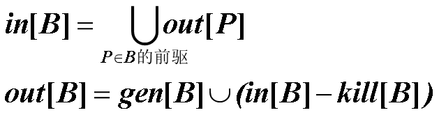
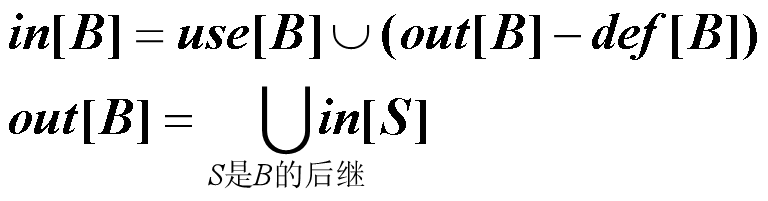
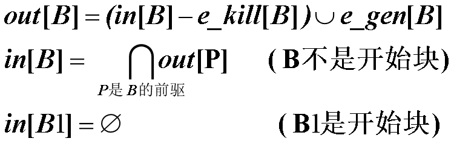
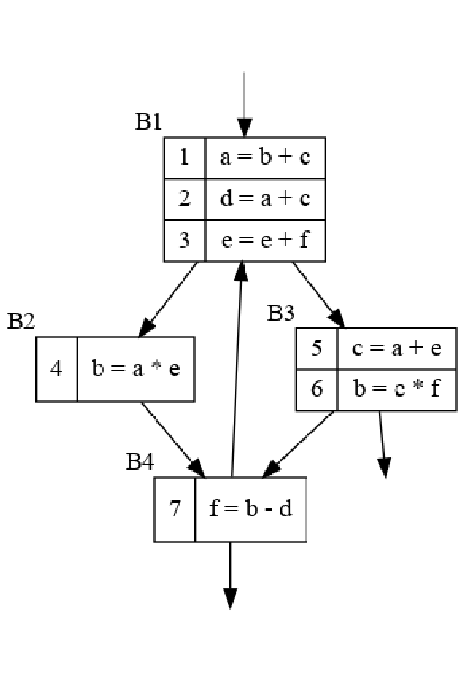

# HW 15

> 知识点：
>
> - ud链（Use-Define Chain）和du链
>
>   - ud：一个变量的使用点（Use）回溯到它最近的定义点（Define），instruction-wise
>   - du：变量定义点到其各个使用点的关系，variable-wise
>
> - 三个数据流问题
>
>   - 到达定值：可能沿着某条路径到达程序点的定值
>
>     > 应用：常量折叠
>     >
>     > 相关集合：
>     >
>     > ```
>     > gen[B]：基本块B中的定值d到达B的结束点，则d∈gen[B]
>     > kill[B]：程序中不能到达B的结束点的定值d，则d∈kill[B]
>     > in[B]：到达B的开始点的定值集合
>     > out[B]：到达B的结束点的定值集合
>     > ```
>     >
>     > 流方程
>     >
>     > 
>
>   - 活跃变量：如果对于变量x和点p，x的值在由p点开始的路径上是否引用，如果引用，则称x在p点活跃，否则称x在p点死亡
>
>     > 应用：寄存器分配优化，如果寄存器中的值在基本块结束死亡，则不用写回内存，这个寄存器也可以优先被分配它用
>     >
>     > 相关集合：
>     >
>     > ```
>     > in[B]：块B开始点的活跃变量集合
>     > out[B]：块B结束点的活跃变量集合
>     > def[B]：块B中无二义定值且在该定值前没有引用的变量集
>     > use[B]：块B中可能引用且在该引用前没有定值的变量集
>     > ```
>     >
>     > 流方程：
>     >
>     > 
>
>   - 可用表达式：从程序的初始点到该点的每条路径上都有对该表达式的计算，且在最后一个这样的计算和该点之间没有对此表达式中所用到的变量的赋值
>
>     > 应用：寻找公共子表达式；
>     >
>     > 相关集合：
>     >
>     > ```
>     > in[B]：块B开始点的可用表达式集合
>     > out[B]：块B结束点的可用表达式集合
>     > e_gen[B]：块B生成的可用表达式集合
>     > e_kill[B]：U中被块B注销的可用表达式集合
>     > ```
>     >
>     > 数据流方程
>     >
>     > 
>
>   


### 练习8.3.1：

为下面流图中的程序计算

1. ud链和du链
2. 每块末尾的活跃变量
3. 可用表达式



1. UD:

   ```
   1: b:{4,6} c:{5}
   2: a:{1} c:{5}
   3: e:{3} f:{7}
   4: a:{1} e:{3}
   5: a:{1} e:{3}
   6: c:{5} f:{7}
   7: b:{4,6} d:{2}
   ```

   DU:

   ```
   1. a:{2,4,5}
   2. b:{7}
   3. e:{3,4,5}
   4. b:{1,7}
   5. c:{1,2,6}
   6. b:{1,7}
   7. f:{3,6}
   ```

2. ```
   B1:a,c,d,e,f
   B2:b,c,d,e
   B3:b,c,d,e
   B4:b,c,d,f
   ```

3. |      | IN           | e_gen        | e_kill                | OUT          |
   | ---- | ------------ | ------------ | --------------------- | ------------ |
   | B1   | b-d          | b+c<br />a+c | b-d<br />a*e<br />a+e | b+c<br />a+c |
   | B2   | b+c<br />a+c | a*e          | b+c<br />b-d          | a+c<br />a*e |
   | B3   | b+c<br />a+c | a+e<br />c*f | b+c<br />a+c<br />b-d | a+e<br />c*f |
   | B4   |              | b-d          | c*f                   | b-d          |
   |      |              |              |                       |              |

   