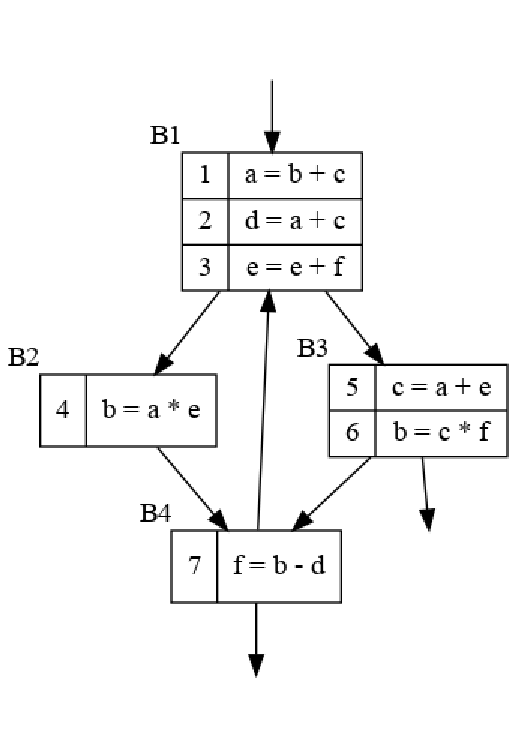
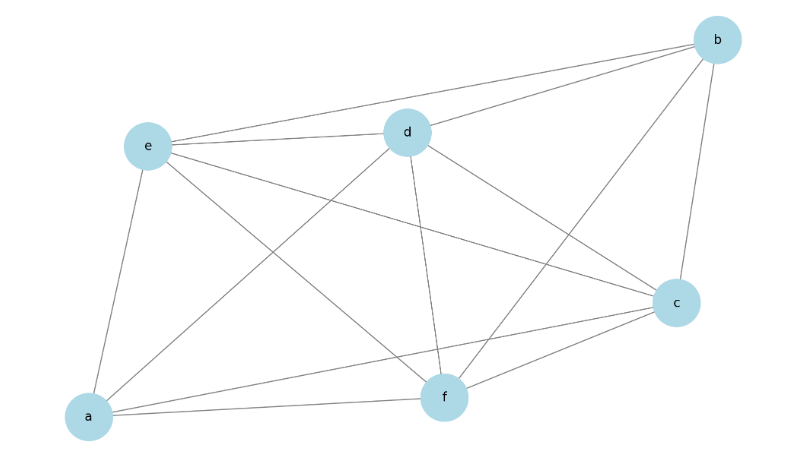

# HW 16

> 知识点：
>
> - 寄存器冲突图
>
>   - 组成：
>
>     - **节点（Nodes）**：图中的每个节点通常代表一个变量或者一个临时表达式的结果。
>     - **边（Edges）**：如果两个变量在程序的同一时间段内都活跃，它们之间就会有一条边，表示这两个变量不能共享同一个寄存器（即它们相互"冲突"）。
>
>   - 作用：可通过图着色算法（Graph Coloring Algorithm）或其他算法进行寄存器分配优化
>
>     > 至少需要多少寄存器：
>     >
>     > 使用图着色算法，如贪心算法，来尝试为寄存器冲突图的每个节点分配颜色。通过算法运行结果确定图的色数，也就是所需的最小寄存器数。
>
> - 三地址代码：先前hw已出现

### 练习8.4.1

为流图中的程序计算

1. 寄存器冲突图

2. 如果要避免寄存器溢出，至少需要多少寄存器？为什么？

3. 

   

1. 活跃变量如下表：

| -    | gen  | use     | in      | out       |
| ---- | ---- | ------- | ------- | --------- |
| B1   | a,d  | b,c,e,f | b,c,e,f | a,c,d,e,f |
| B2   | b    | a,e     | a,c,d,e | b,c,d,e   |
| B3   | b,c  | a,e,f   | a,d,e,f | b,c,d,e   |
| B4   | f    | b,d     | b,c,d,e | b,c,e,f   |

可视化如下：


其中a和b的活跃区间不重合，课共用一个寄存器，而其余变量的活跃区间各自有交集，则不可共用，至少需要五个寄存器。

### 练习8.4.2

为下面的每个 C 语言赋值语句生成三地址代码

```
x = a + b * c;
a[i] = b[c[i]];
*p++ = ++*q
```

1. ```
   t1 = b * c
   x = a + t1
   ```

2. ```
   t1 = sizeof(c) * i
   t2 = c[t1]
   t1 = sizeof(b) * t2
   t2 = b[t1]
   t1 = sizeof(a) * i
   a[t1] = t2
   ```

3. ```
   t1 = *q
   t1 = t1 + 1
   *q = t1
   *p = t1
   p = sizeof(*p)+p
   ```

   


