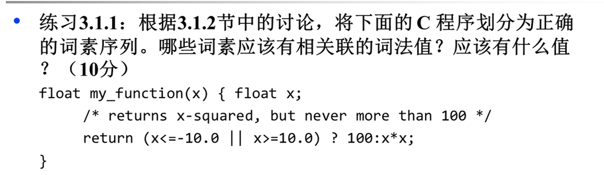
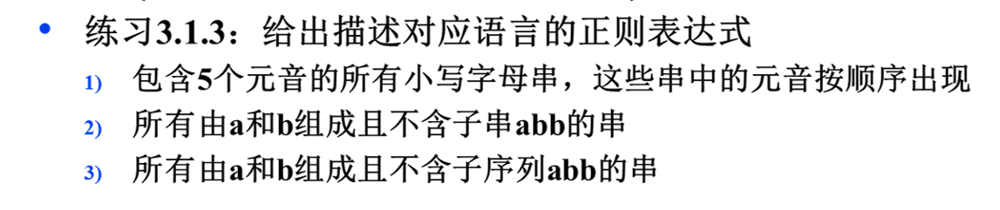

# HW3

>知识点：
>
>- 概念：词素、词素序列、词法值；
>- 正则表达式<->语言
>- 子序列vs子串
>  - 子序列：一个给定的序列的子序列是在该序列中删除若干元素后得到的序列；
>  - 子串：字符串中任意个连续的字符组成的子序列称为该串的子串。



词素序列如下:

```c
<float> <id,my_function> <(> <id,x> <)> <{>
    <float> <id,x> <;>
    <return> <(> <id,x> <comparison,<=> <number,-10.0> <op, ||> <id,x> <comparison,>=> <number,10.0> <)> <op,?> <id,x> <op,:><id,x> <op,*> <id,x> <;>
<}>
```

词素与关联词法值:

- 对于标点符号,关键字以及运算符:词素与词法值皆为本身;
- 对于数字(如-10.0)与变量(如x,my_function),其词素为词法项的第二项,
  - 变量词法值为指向词素条目的指针
  - 数字词法值为该数字的实际数值


1) 字母表为{a,b},  至多只含一个'b'的串;

2) 字母表为{a,b},  任意串;

3) 字母表为{a,b},  含偶数个a和偶数个b的串

   




```
1. 设所有由辅音字母构成的串记为F：F*a（a|F）*e(e|F)*i(i|F)*o(o|F)*u(u|F)*
2. b*(ab)*a*
3. b*a*(b|ε)a*
```

> 第二个修订：`b*(a|ab)*`，否则无法生成aab

