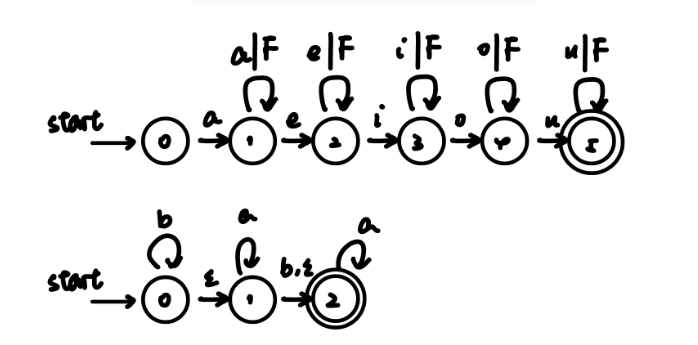
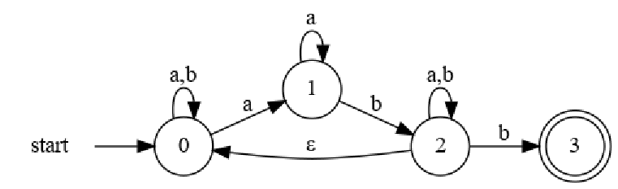
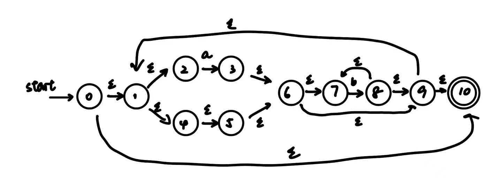
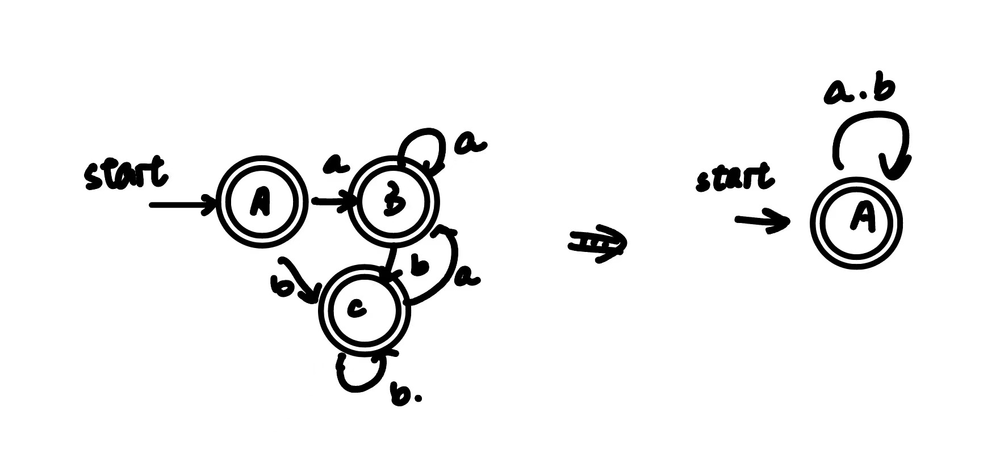
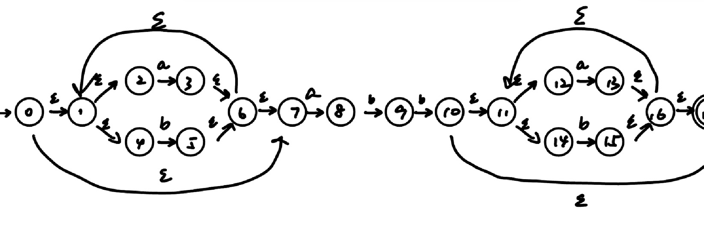
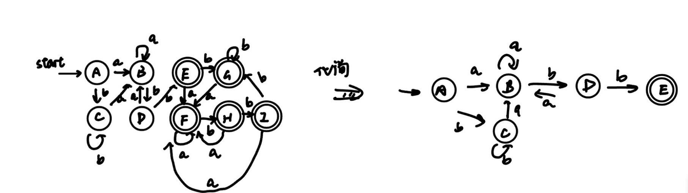

# HW4

> 知识点
>
> - DFA/NFA<->语言；
> - NFA/DFA执行过程（如何得到某个串）；
> - NFA->DFA
> - DFA化简

### 练习3.2.1

为下面的语言设计一个DFA或NFA
       1) 包含5个元音的所有小写字母串，这些串中的元音按顺序出现
       2) 所有由a和b组成且不含子串abb的串

设F可派生所有辅音字母：



> 第二小问承接上一次作业最后一题，美美连环做错:)

## 练习3.2.2

模拟下图所示NFA处理输入aabb的过程



算法如下：

```
S = ε-closure(s0);
c = nextChar();
while(c!=EOF){
	S = ε-closure(move(S,c));
	c = nextChar();
}
if(S∩F!=⌀) return "yes";
else return "no";
```

执行过程如下：

```
S = {0}
F = {3}
c = nextChar() = a
S = ε-closure(move(S,c)) = {0, 1}
c = nextChar() = a
S = ε-closure(move(S,c)) = {0, 1}
c = nextChar() = b
S = ε-closure(move(S,c)) = {0, 2}
c = nextChar() = b
S = ε-closure(move(S,c)) = {0, 2, 3}
S∩F!=⌀, return "yes"
```


### 练习3.2.3

使用算法3.23和3.20将下述正则表达式转换为DFA，并尝试化简该DFA

    1) ((ε | a)b*) *
    2) ( a | b ) *abb(a | b ) *

1. 先用算法3.23构造NFA:
   

​	利用算法3.20将之转化为DFA:

| NFA状态                             | DFA状态 | a    | b    |
| ----------------------------------- | ------- | ---- | ---- |
| {0,1,2,4,5,6,7,9,10}                | A       | B    | C    |
| ε-closure({3})={1,2,3,4,5,6,7,9,10} | B       | B    | C    |
| ε-closure({8})={1,2,4,5,6,7,8,9,10} | C       | B    | C    |

绘制DFA:


2. 先用算法3.23构造NFA:



| NFA状态                                                      | DFA状态 | a    | b    |
| ------------------------------------------------------------ | ------- | ---- | ---- |
| {0,1,2,4,7}                                                  | A       | B    | C    |
| ε-closure({3,8})={1,2,3,4,6,7,8}                             | B       | B    | D    |
| ε-closure({5})={1,2,4,5,6,7}                                 | C       | B    | C    |
| ε-closure({5,9})={1,2,4,5,6,7,9}                             | D       | B    | E    |
| ε-closure({5,10})={1,2,4,5,6,7,10,11,12,14,17\}              | E       | F    | G    |
| ε-closure({3,8,13})={1,2,3,4,6,7,8,10,11,12,13, 14,16,17}    | F       | F    | H    |
| ε-closure({5,15})={1,2,4,5,6,7,10,11,12,14,15,16,17}         | G       | F    | G    |
| ε-closure({5,9,15})={1,2,4,5,6,7,9,11,12,14,15,16,17}        | H       | F    | I    |
| ε-closure({5,9,10,15}) = {1,2,4,5,6,7,9,10,11,12,14,15,16,17} | I       | F    | G    |


构造DFA:



> Note：此处画出的DFA非最简，，，

## 练习3.2.4*

所有能被3整除的**正整数**的二进制串能否被正则表达式表示？如果能，给出一个正则表达式；如果不能，讨论其原因。

可以构造DFA再由DFA->正则表达式。

对于能被3整除的二进制数（注意这里不要求是正数），有以下三种状态：

1. 状态0：当前余数为0（即目前为止的部分和能被3整除）。
2. 状态1：当前余数为1。
3. 状态2：当前余数为2。

状态转移如下：

> - 从状态0开始，读入0->状态0，读入1->状态1。
> - 从状态1开始，读入0->状态2，读入1->状态0。
> - 从状态2开始，读入0->状态1，读入1->状态2。

由上述状态机可得正则表达式：
$$
(0|(1(01*0)*1))*
$$
由于我们要求其是正整数，则其必为1开头，则`0`这一分支必须严格置于`(1(01*0)*1)`之后，且整个串非空，可修改如下：
$$
(1(01*0)*10*)+
$$
