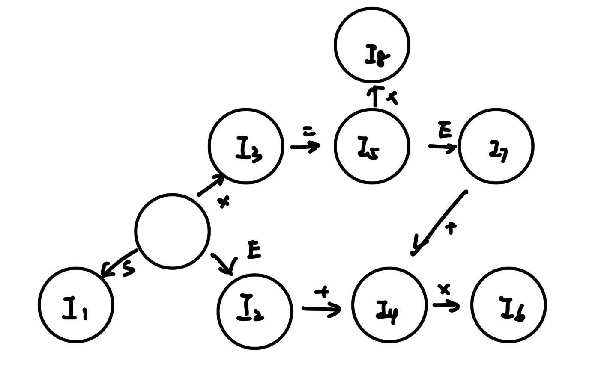

# HW7

> 知识点：
>
> - 规约句柄，相关概念：句型&句子，句柄
>
>   - 句型：若S->A，其中S是文法开始符号，称A是文法G的句型（A可以含终结符、非终结符，or是空串）；
>
>     > 最右句型：从文法的开始符经过最右推导得到的句型；（规约时应该对应最左规约）
>
>   - 句子：不含非终结符的句型（也即完全推导完的串）；
>
>   - 文法的语言：句子的集合；
>
>     > 上下文无关语言：可由文法生成的语言）；
>
>   - 句柄：句型中可以规约为某个非终结符的部分；
>
> - 增广文法（即加个新的开始符号S'和产生式S'->S，目的：使得文法开始符号仅出现在一个产生式左边）
>
> - SLR状态集&转移图
>
> - SLR / 规范LR（即LR(1)）/ LALR 项目集GOTO函数
>
>   > 这部分内容比较多，详细讲解见本次作业末尾的附录（起初我以为只要会手搓作业里的就可以，小测整了个LR(1)给我干懵了🤗）
>
> - 语法分析表
>
> - SLR文法定义

## 练习4.3.1

对于文法 `S → SS+ | S* | x `，指出下列最右句型归约时使用的句柄：

```
x*x+xx++
SS+x*+
SS*+
```

1. 最左边的x
2. SS+
3. S*

> 句柄是最右句型（right-sentential form）中最左边的最简子结构，它对应于某个产生式的右部。

## 练习4.3.2

考虑文法
		S → x = E | E
		E → E + x | x

1. 增广该文法，构造 SLR 项目集和状态转化图
2. 计算项目集的 GOTO 函数和这个文法的语法分析表
3. 这个文法是不是 SLR 文法？为什么？

---

1. 增广文法：
	```
   S'->S
   S → x = E | E
   E → E + x | x
   ```
   
	SLR项目集：
	
	```
	I0：
	S'→.S
	S→.x=E
	S→.E
	E→.E+x
	E→.x
	
	I1：
	S'→S.
	
	I2：
	S→E.
	E→E.+x
	
	I3：
	S→x.=E
	E→x.
	
	I4：
	E→E+.x
	
	I5：
	S→x=.E
	E→.E+x
	E→.x
	
	I6：
	E→E+x.
	
	I7：
	S→x=E.
	E→E.+x
	
	I8：
	E→x.
	```
	
	状态转化图：



> 这里边构造边画图比较好


2. GOTO 函数

   ```
   GOTO(I0，S) = I1
   GOTO(I0，E) = I2
   GOTO(I0，x) = I3
   GOTO(I2，+) = I4
   GOTO(I3，=) = I5
   GOTO(I4，x) = I6
   GOTO(I5，E) = I7
   GOTO(I5，x) = I8
   GOTO(I7，+) = I6
   ```

   规则编号：

   ```
   1. S'->S
   2. S → E 
   3. S → x = E
   4. E → x 
   5. E → E + x
   ```

   

   语法分析表

   | 状态 | ACTION | -    | -    | -    | GOTO | -    |
   | ---- | ------ | ---- | ---- | ---- | ---- |---- |
   |      | x      | +    | =    | $    | S    |E|
   | 0    | s3     |      |      |      | 1    |2|
   | 1    |      |      |      | acc  |     ||
   | 2    |      | s4   |      | r2   |      ||
   | 3    |      | r4 | s5   | r4 |      ||
   | 4    | s6   |      |      |      |      ||
   | 5 | s8 |      |      |      | |7|
   | 6 |  |    |      | r5  | ||
   | 7 |  | s4  |      | r3  | ||
   | 8 |  | r4   |      | r4   | ||

   > **Non-terminals (Goto part of the table):**
   >
   > 不包含shift/reduction等动作，只包含state，故不需要r/s来区分；
   >
   > **Terminals(Action part)：**
   >
   > - "s数字"（shift） 表示移入并转到相应的状态。
   > - "r数字"（reduction） 表示按照文法的第几条规则进行归约。
   >
   > **补充——关于“r”放在哪：**
   >
   > shift（s）还是比较明显，rule（r）的放置还需要考虑**特定支路**下的FOLLOW集，下结合上述表格中r的放置进行分析
   >
   > - M(2,\$)：此处是针对I2中的`S→E.`一项，使用了第二条规则规约（r2），该支路中E的FOLLOW集是{\$}，故将r2放置在该格；
   >
   >   > 为何强调“支路”：可以看到后面E的FOLLOW集中应该还包含`+`，但倘若E由在S->E这个产生式推导得来，其后不可能follow其他任何终结符，故只包含\$。
   >
   > - M(3,\$), M(3,\+)：此处是针对I3中`E→x.`这一项，使用了第四条规则规约（r4），由于我们无法确定这个E是`S→x=E `还是`E→E+x`推导得到的，其FOLLOW集应为{\$, +}，故在M(3,\$), M(3,\+)格中都放置了r4。

3. 构造SLR分析表无冲突，故是SLR文法

## 练习4.3.3

对 4.3.2 中文法

1. 构造规范 LR 项目集和状态转化图
2. 构建语法分析表 
3. 构建 LALR 项目集族

---

1. LR项目集：

   ```
   I0：
   S'→.S,$
   S→.x=E,$
   S→.E,$
   E→.E+x,$/+
   E→.x,$/+
   
   I1：
   S'→S.,$
   
   I2：
   S→E.,$
   E→E.+x,$/+
   
   I3：
   S→x.=E,$
   E→x.,$/+
   
   I4：
   E→E+.x,$/+
   
   I5：
   S→x=.E,$
   E→.E+x,$/+
   E→.x,$/+
   
   I6：
   E→E+x.,$/+
   
   I7：
   S→x=E.,$
   E→E.+x,$/+
   
   I8：
   E→x.,$/+
   ```

   状态转换图

   

2. 语法分析表

   | 状态 | ACTION | -    | -    | -    | GOTO | -    |
   | ---- | ------ | ---- | ---- | ---- | ---- | ---- |
   |      | x      | +    | =    | $    | S    | E    |
   | 0    | s3     |      |      |      | 1    | 2    |
   | 1    |        |      |      | acc  |      |      |
   | 2    |        | s4   |      | r2   |      |      |
   | 3    |        | r4   | s5   | r4   |      |      |
   | 4    | s6     |      |      |      |      |      |
   | 5    | s8     |      |      |      |      | 7    |
   | 6    |        | r3   |      | r3   |      |      |
   | 7    |        | s6   |      | r1   |      |      |
   | 8    |        | r4   |      | r4   |      |      |

3. 构建 LALR 项目集族：LR(1)项集中状态皆不可合并，故LALR 项目集族即LR(1)项集。


## 项目集

### 项目集的定义

1. **项目（Item）**：一个项目是一个文法产生式，其中包含了一个额外的点（通常用一个点号“•”表示），用来标记解析过程中的位置。例如，如果有一个产生式 `A → XYZ`，那么相应的项目可以是 `A → X•YZ`，表示解析器已经识别了X，下一个期待识别的是Y。

2. **LR(0) 项目**：不包含前瞻信息的项目。例如，`A → X•YZ` 是一个LR(0)项目。

3. **LR(1) 项目**：包含一个前瞻符号的项目，该符号表示在此产生式规则应用之后可能出现的下一个输入符号。例如，`A → X•YZ, a` 是一个LR(1)项目，其中“a”是前瞻符号。

   > 前瞻符号是结合FOLLOW集确定的（其实这里用了SLR(1)分析的思想），每个项目具有唯一得到前瞻符号，如在分析产生式的时候发现一个式子有可能有多个前瞻符号，则拆分成多个项目，但是可以放在一起书写，如对于
   >
   > ```
   > C->cC|d
   > ```
   >
   > [C->.cC，c]和[C->.cC，d]可合并写作：
   >
   > ```
   > C->.cC，c/d
   > ```
   >
   > 
   >
   > 示例：
   >
   > 1）对于文法
   >
   > ```
   > E → E + T | T
   > T → id
   > ```
   >
   > 考虑产生式 `E → E + T`。假设我们正在构建E的一个LR(1)项目，并且当前项目是 `E → E• + T`。在这个例子中，前瞻符号是紧跟在这个产生式后面的符号，即 `+`。因此，对于这个项目，前瞻符号是 `+`。
   >
   > 2）对于文法
   >
   > ```
   > E → E T 
   > ...
   > ```
   >
   > 当前项目是 `E → E1• TL`（写作E1辅助区分）。在这个例子中，考虑FOLLOW(E1)：
   >
   > - 若ε∈FIRST(T)，前瞻符号还需考虑FIRST(L)，为`(FIRST(T)-{ε})∪FIRST(L)`中的元素
   > - 若FIRST(T)不含空串，则即为FIRST(T)

### 项目集作用

在文法和解析器实现之间起到了桥梁的作用。将文法规则转换为解析器可以操作的状态和转换。

## 解析时的两种冲突

### 移入-归约冲突

移入-归约冲突发生在解析表的同一格中，既可以进行移入（shift）操作，也可以进行归约（reduce）操作。在SLR(1)解析器中，这种冲突发生的原因通常是因为一个符号既出现在某个产生式的右侧（导致移入），又出现在某个非终结符的FOLLOW集中（导致归约）。

### 归约-归约冲突

归约-归约冲突发生在解析表的同一格中有两个或以上的归约操作。这通常发生在非终结符的FOLLOW集有交集的情况下。

### 冲突识别

在构建语法分析表的时候，我们可能会发现在某些状态下，**对于同一输入符号既有移入动作也有归约动作的情况**，这就是移入-归约冲突。同样，如果**在一个条目中有两个或更多的归约动作**，那么就出现了归约-归约冲突。

## LR(0)，LR(1)，SLR(1) 和 LALR 文法

### LR(0) 文法

1. **定义**：LR(0) 文法是一类特殊的上下文无关文法，其对应的LR(0) 解析表完全由其状态和栈顶符号决定，而不依赖于输入串的剩余部分（无前瞻）。

   > LR(0)项目是形式为 `A → α•β` 的产生式，其中点号（•）表示解析过程中的当前位置。

2. **特征**：LR(0) 文法的每个状态对应于一组LR(0) 项目（产生式与一个点标记当前解析位置）。LR(0) 文法要求其解析表中不存在移入/归约或归约/归约的冲突。

### LR(1) 文法

1. **定义**：LR(1) 文法是一类上下文无关文法，其对应的LR(1) 解析表不仅取决于状态和栈顶符号，还取决于输入串中的下一个符号（有一个符号的前瞻）。

   > LR(1)项目是形式为 `A → α•β, a` 的产生式，其中点号（•）表示当前位置，a是后续的查看符号（lookahead）。

2. **特征**：LR(1) 文法的每个状态对应于一组LR(1) 项目（产生式与点标记当前解析位置，加上一个前瞻符号）。LR(1) 文法要求其解析表中不存在任何冲突。

### SLR(1) 文法

1. **定义**：简化LR(1)（SLR(1)）文法是LR(0) 文法的扩展，它使用与LR(0)相同的项目集，但在决定归约动作时，会考虑非终结符的FOLLOW集。

2. **特征**：SLR(1) 文法比LR(0) 文法的解析能力更强，因为它在归约时考虑了FOLLOW集，但它的解析表仍可能存在冲突（可以解决归约-归约冲突，但是不一定能解决移进-归约冲突）。

   > 在这里可以看其产生冲突的例子：[【编译原理笔记07】语法分析：SLR、LR(1)、LALR、二义性分析与错误处理_心：卜：义；｀：，：：延迟↖…义。；‘孞-CSDN博客](https://blog.csdn.net/weixin_42815609/article/details/107631357)

### LALR 文法

1. **定义**：查找-向前看LR（LALR）文法是一种折中方法，它将**具有相同核心但不同前瞻符的LR(1) 项目集合并**，从而减少了状态的数量，同时保持了LR(1) 的解析能力。

   > 项集的核心就是其第一分量的集合

2. **特征**：LALR文法解析器在实际应用中很受欢迎，比SLR(1)更强大，同时比完整的LR(1)解析器更节省资源。
