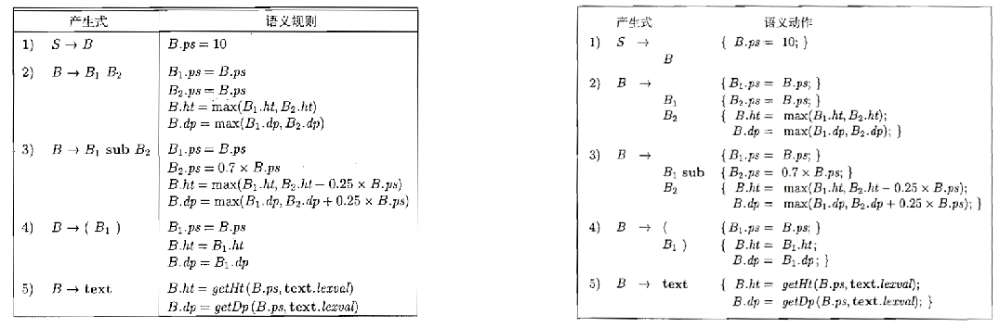

# HW9

> 知识点（本次作业大部分recap前面）：
>
> - 设计SSD（Syntax-Directed Def.，语法制导定义，产生式+语义规则）
> - SDT（Syntax-Directed Translation Scheme，语法制导翻译方案，产生式+语义动作）

## 练习5.2.1：

考虑文法
		E → E + T | T
		T → T \* F | F
		F → ( E ) | num | var

1. 其中 num 表示数字字面量，如123；var 表示变量，如 x。
   如果一个项或表达式中不存在变量，它可以在编译期进行求值，例如 1+2\*3。设计一个 SDD 来判断各个项 T 和表达式 E 能否在编译期确定它的值。（备注：可以用 E.isconst = true 表示它可以在编译期求值）
2. \*扩展上面的 SDD，使其对表达式中的常量进行简单的化简。例如对于 3\*2+x+y\*(5+3) ，改写为 6+x+y\*8 。我们不要求使用交换律等算术规律进行化简，例如不必要化简 3+x+4（选做）

---

| 表达式    | 语义规则                            |
| --------- | ----------------------------------- |
| E → E + T | E.isconst = E1.isconst && T.isconst |
| E → T     | E.isconst = T.isconst               |
| T → T * F | T.isconst = T1.isconst && F.isconst |
| T → F     | T.isconst = F.isconst               |
| F → ( E ) | F.isconst = E.isconst               |
| F → num   | F.isconst = true                    |
| F → var   | F.isconst = false                   |


## 练习5.2.2：

改写下面的 SDT，消除左递归。其中a、b、c、d为语义动作，不涉及属性计算。0和1是终结符。
		A → A {a} B | A B {b} | 0
		B → B {c} A | B A {d} | 1

---

1. 将原始文法分成左递归部分和非左递归部分：
```
   A → A X | 0
   B → B Y | 1
   X → {a} B | B {b} 
   Y → {c} A | A {d}
```

2. 对左递归的产生式进行改写：

   ```
   A → 0 A'
   A' → ε | X A'
   ```
   
   ```
   B → 1 B'
   B' → ε | Y B'
   ```

3. 最终得到：

   ```
   A → 0 A'
   A' → ε | X A'
   B → 1 B'
   B' → ε | Y B'
   X → {a} B | B {b} 
   Y → {c} A | A {d}
   ```

   

## 练习5.2.3：

(详见课本213)

考虑下图中排版语言的 SDD 和 SDT

1. 修改 SDD，使其包含一个综合属性 B.ch，表示 Box 中字符的个数。用 getCh(text.lexval) 表示 text 中字符的个数
2. 将新规则加入 SDT 的合适位置



---
以`...`表示原表格中内容

| 产生式       | 语义规则                         |
| ------------ | -------------------------------- |
| S->B         | ...<br />S.ch=B.ch               |
| B->B1B2      | ...<br />B.ch=B1.ch+ B2.ch       |
| B->B1 sub B2 | ...<br />B.ch=B1.ch+ B2.ch       |
| D->(B1)      | ...<br />D.ch=B1.ch+ 2           |
| B->text      | ...<br />B.ch=getCh(text.lexval) |

> Note：答案此处将`D.ch=B1.ch+ 2`写作  `D.ch=B1.ch`，是因为其将括号视作文法原符号，而非文法生成的符号

| 产生式                             | 语义动作                                             |
| ---------------------------------- | ---------------------------------------------------- |
| S-><br />      B                   | {...}<br />{S.ch=B.ch}                               |
| B-><br />      B1<br />      B2    | {...}<br /><br />{...}<br />{...; B.ch=B1.ch+ B2.ch} |
| B-><br />     B1 sub <br />     B2 | {...}<br />{...}<br /><br />{...; B.ch=B1.ch+ B2.ch} |
| D-><br />      (<br />       B1)   | {...}<br /><br />{...}<br />{...; D.ch=B1.ch+ 2}     |
| B->text                            | {...; B.ch=getCh(text.lexval)}                       |


## 练习5.2.4：

为下面的产生式写出一个和例5.19类似的 L 属性 SDT。这里的每个产生式表示一个常见的 C 语言中那样的控制流结构。你可能需要生成一个三地址语句来跳转到某个标号 L，此时你可以生成语句 goto L

```
S → if ( C ) S1 else S2
S → do S1 while ( C )
S → { L } 和 L → L S | ε
```

注1：列表中的任何语句都可能包含一条从它的内部跳转到下一条语句的跳转指令，因此简单地为各个语句按顺序生成代码是不够的。 

注2：可以先写出SDD，然后按照5.4.5节方法转换为SDT。

---

1. ```
   S -> if (C) S1 else S2 	L1 = new();
   						L2 = new();
   						C.true = L1;
   						C.false = L2;
   						S1.next = S.next;
   						S2.next = S.next;
   						S.code = C.code || label || L1 || S1.code || goto S.next || label || L2 || S2.code;
   ```

   ```
   S -> if (				{L1 = new();
   						L2 = new();
   						C.true = L1;
   						C.false = L2;}
   		C) 				{S1.next = S.next;}
   		S1 else 		{S2.next = S.next;}
   		S2 				{S.code = C.code || label || L1 || S1.code || goto S.next || label || L2 || S2.code;}
   ```

2. ```````
   S -> do S1 while ( C ) 	L1 = new();
   						L2 = new();
   						C.true = L1;
   						C.false = S.next;
   						S1.next = L2;
   						S.code = label || L1 || S1.code || label || L2 || C.code;
   ```````

   ```
   S -> do 				{L1 = new();
   						L2 = new();
   						S1.next = L2;}
   	S1 while ( 			{C.true = L1;
   						C.false = S.next;}
   	C ) 				{S.code = label || L1 || S1.code || label || L2 || C.code;}
   ```

2. 
   
   ```````
   S → { L }				L.next = S.next;
   						S.code = L.code;
   
   L → L1 S 				T = new();
   						L1.next = T;
   						S.next = L.next;
   						L.code = L1.code || label || T || S.code; 
   L → ε 					L.code = "";
   ```````
   
   ```
   S → { 					{L.next = S.next;}
   	L }					{S.code = L.code;}
   
   L → 					{T = new();
   						L1.next = T;}
   	L1 					{S.next = L.next;}
   	S 					{L.code = L1.code || label || T || S.code; }
   						
   						
   L → ε 					{L.code = "";}
   ```

 

## 练习5.2.5\*：

按照5.5.3节的风格，将第 5.2.4题中得到的每个 SDT 和一个 LL 语法分析器一起实现，但是代码（或指向代码的指针）存放在栈中（选做）

## 练习5.2.6\*：

按照5.5.4节的风格，将第 5.2.4 题中得到的每个 SDT 和一个 LR 语法分析器一起实现（选做）


## 补充：SDD & SDT

表面上看上去类似，侧重点不同：

- 语义规则更多地关注于“什么”（what to compute）而不是“如何”（how to compute）。

- 语义动作更多关注于计算的具体实现和执行顺序。

  > - 语义动作按照它们在产生式中出现的顺序执行。
  >
  > - 综合属性的计算通常发生在产生式右侧的末尾，而继承属性的计算则可能发生在产生式的任何位置。
  >
  > - 如何确定动作的位置：要确保在读取到某个变量时相应的flow和值都已经被确定了，如5.2.4的if-else：
  >
  >   ```
  >   S -> if (				{L1 = new();
  >   						L2 = new();
  >   						C.true = L1;
  >   						C.false = L2;}
  >   		C) 		
  >   ```
  >
  >   在读取到C之前相应的执行flow（C.true和C.false）已经被完全确定

  